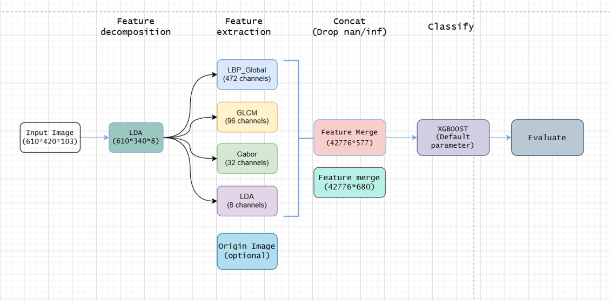

# High_spectrum_BIT
北京理工大学图像分析与智能理解大作业-多方法高光谱图像分析分类

##### 数据阐述及光谱特征分析

本次实验中所选取的数据来源于帕维亚大学上空的高光谱遥感图像，空间分辨率610*340，光谱维度为103，FLatten*()处理后，二维数据为207400*103，有效标记点数42776，最右边的那张图准确标注了那些像素得到了对应的标记。

##### 关于光谱的特征分析主要是采用是两种方法

第一种是光谱的协方差矩阵的热力图

第二种是特征得分，特征得分是基于随机森林的特征重要度和相关分析中的相关系数而成，在归一化之后分别赋予对应的权重系数。首先分析一下特征重要度的缺点，它倾向于选择大量数据的数字特征和分类特征，但是在相关的特征的选择上，它倾向于选择单一特征而忽略第二个较大相关重要度的特征。而相关分析只能获取特征间的近似线性关系。这是一种针对特征监督定量分析的方法，通过计算特征得分，我们可以克服随机森林基尼系数和相关分析各自的缺点，定量分析各个特征在分类中的重要性。

具体的计算方式是，计算样本的每个特征的基尼系数，同时计算光谱维度间的相关矩阵，提取对应label列的相关系数，这两个值分别计算对应加权和，得到最后的特征得分。左图是103个特征的特征重要度和相关重要度以及对应的特征得分，右图是上述的表格中的归纳统计值。定量分析各个特征在分类中的重要性。我们可以看出不同维度间的特征得分有较大的区别。由于时间缘故，后续并没有根据做出对应的数据降维的实验，这里只作为光谱特征分析进行叙述。

##### 数据降维

由于高光谱图像包含数百个窄的连续带，因此频带（特别是相邻频带）之间通常具有强相关性。 为了增加所显示的信息量，通常将图像的维度降低到具有较高信息密度的较小的一组特征（例如，通过PCA和LDA两种方式）

本次作业中选取了这两种方法，通过训练一个弱分类器即不做任何处理，分类器选择的主要模型是最基础的SVM模型，训练集和测试集的分割比例是50%，评价指标分别是OA和AA、kappa系数三个指标。我们可以看出在相较于输入原始的图像，LDA方法较高的保存了图像的信息，最终的维度为8维。PCA结果及对应降维方法的可视化图像这里可以见PPT。

##### 下一步接受此次大作业的整体框架，主要是五个部分分别是特征降维，特征提取，特征级联及一些特征值的处理（包括丢弃特征中重复值，无穷值，缺失值，特征归一化等几个简单的处理方法），最后丢入分类器，本次选取的分类器是XGboost，最后进行评估的操作。

注重介绍一下特征提取的三个部分，分别是LBP GLCM Gabor 等三个特征提取的方法，同时在网络的训练中，我们发现将LDA放入后，精度也会有所特征。同时，在回到之前的数据的数据降维的过程中，我们发现，将原始的图像送入分类器精度较降维后而未做特征提取有较大的提高。如果特征提取后，再将原始的图像堆叠进去，精度是否也会有较大的提升，具体的结果将在后面具体展示。

下面简单介绍一下XGBoost，巴啦巴拉。

最后来到多特征级联高光谱图像分割的结果分析，选取了6种数据集划分比例分别是1% 2% 5% 10 % 20% 50%，具体的实验指标如表格所示，1%左右可以到达93.5%左右，2%可以达到95.6% 5%可以到达97.83%。训练集和测试集选择的采样方式是分层抽样，也就是根据GroundTruth中各种类别所占的各种比例来进行抽样。由于时间缘故，没有进行网格搜索优化参数。针对之前特征提取中的问题，我们发现数据集提升精度不大，部分指标提升或者下降可能仅仅与分类器的特征选择有关。下面是可视化的结果。

##### 接下来，本次大作业中也同样实现了基于深度学习的高光谱图像分类

参考的网络架构中为这篇论文中的混合光谱网络架构，并在网络中2维卷积部分添加了空间注意力和通道注意力机制来提升整体网络的泛化性。

下面介绍一下网络中的Patch块的提取，算法主要以滑动窗口为主，类似于卷积操作，提取以该像素点中心为所有窗口的像素，这里以3*3为例，也就是同时提取自己和周围八领域的像素。最终直至提取所有的单个像素后。因为要对每个通道都进行上面的操作，受内存的限制，这里采取先降维的方法。

下面是张量shape变化更好介绍过程，首先是降维，然后Patch块提取，最后提取有效标记的数据集。

以10%训练集划分，下面是网络的混淆矩阵和网络的收敛的情况。

最后是实验结果的评估，同样也是6种数据集的划分比例，具体结果请看表格。最后是可视化的输出
